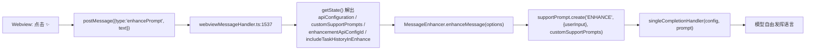
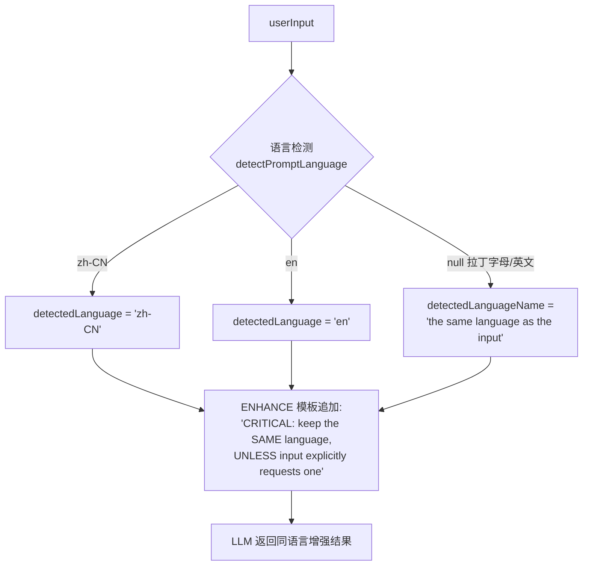
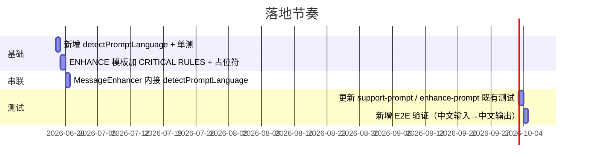

# 增强提示词（Enhance Prompt）语言一致性 — 修复方案

> 状态：待评审
> 适用范围：Roo Code 聊天输入框 ✨ 按钮（`supportPrompts.ENHANCE`）
> 作者意图：让"提示增强"功能在不改写原意的前提下保持输入语言不变

---

## 1. 问题描述

### 1.1 用户场景

- **输入语言**：中文（简体）
- **当前行为**：点击"增强提示词"按钮后，模型把中文 prompt 改写成英文版本。
- **期望行为**：输入是中文就输出中文，输入是英文就输出英文，**只润色不翻译**。

### 1.2 具体例子

| 输入                                        | 当前输出（错误）                                          | 期望输出                                                 |
| ------------------------------------------- | --------------------------------------------------------- | -------------------------------------------------------- |
| `帮我写一个函数来计算斐波那契数列`          | `Write a function to calculate the Fibonacci sequence...` | `请帮我编写一个用于计算斐波那契数列的函数，要求：1) ...` |
| `Refactor this function to use async/await` | `Refactor this function...`                               | `Refactor this function to use async/await...` ✅        |

### 1.3 业务影响

用户在中文/日文/韩文等非英文 IDE 环境下工作时，反复在中英之间手动翻译，导致工作流断裂，与"提示增强"这一功能的本意（让用户更省心）相违背。

---

## 2. 根因分析

### 2.1 ENHANCE 模板里没有语言指令

[`src/shared/support-prompt.ts:50-53`](src/shared/support-prompt.ts:50:1)：

```ts
ENHANCE: {
  template: `Generate an enhanced version of this prompt (reply with only the enhanced prompt - no conversation, explanations, lead-in, bullet points, placeholders, or surrounding quotes):

${userInput}`,
},
```

模板只约束了**输出形式**（不要对话/解释/项目符号/引号），**完全没有约束输出语言**。模型在缺少语言指令时会倾向于用训练数据中最常见的英文输出。

### 2.2 调用链上没有注入语言偏好

主聊天系统提示词里有 `Language Preference` 段（[`src/core/prompts/sections/custom-instructions.ts:481-485`](src/core/prompts/sections/custom-instructions.ts:481:1)），但增强提示词走的是独立通道，**未复用**。



### 2.3 插件语言机制本身已存在

- 语言名映射 [`src/shared/language.ts:7-26`](src/shared/language.ts:7:1) 有完整 `LANGUAGES` 表。
- 入口在 [`src/extension.ts:128`](src/extension.ts:128:1)：`initializeI18n(...)`。
- 通过 [`ClineProvider`](src/core/webview/ClineProvider.ts:2098:1) 把 `stateValues.language` 暴露给主系统提示词。

**但 `MessageEnhancer` 走的是另一条独立通道，没有复用 `state.language`**。

---

## 3. 修复方案

### 3.1 总体策略

采用 **"运行时检测 + 模板指令"双保险**：

1. **运行时检测**：用脚本范围（script range）正则判断用户输入的主语言（CJK / Cyrillic / Devanagari / Vietnamese diacritics / 假名 / Hangul）。仅覆盖 `LANGUAGES` 表里存在的语言码。
2. **模板指令（带例外）**：在 `ENHANCE` 模板的 `CRITICAL RULES` 段要求"保持输入语言"，但**显式让模型尊重输入里已有的语言要求**（如 `reply in English` / `用英文回复`）。语言判断交给模型语义理解，而不是用正则去匹配"reply english 类短语"——后者跨语言脆弱、难维护。
3. **检测成功才注入具体语言名**：`detected !== null` 时把语言可读名（如 `简体中文`）通过 `${detectedLanguageName}` 占位符传给模板。
4. **检测失败用中性措辞**：拉丁字母（英文等）不落入任何脚本范围、返回 `null`，此时 `detectedLanguageName` 退化为中性的 `"the same language as the input"`，**不**把 `state.language` 当成"已检测语言"塞进 `language:` 标注，交由 CRITICAL 指令处理。仅在最终确实需要一个 code 时兜底到 `en`。

> 不采用"硬编码插件语言"是因为用户在中文 IDE 里写英文 prompt 也是合理需求。把兜底语言当成强制标签注入会破坏这一场景（英文输入会被误标成 IDE 语言），所以检测失败时只给中性措辞。

### 3.2 方案流程



---

## 4. 具体代码修改

### 4.1 新增文件 `src/utils/prompt-language.ts`

````ts
// src/utils/prompt-language.ts
/**
 * Detects the dominant natural language of a user prompt.
 * Lightweight heuristic that avoids pulling in heavy NLP libraries.
 *
 * Strategy:
 *  1. Quick CJK / Cyrillic / Arabic / Thai / Devanagari script range checks.
 *  2. Fallback to "en" when no clear signal exists.
 *
 * Returns an ISO-639-1-ish code compatible with src/shared/language.ts LANGUAGES map.
 */
// \u4EC5\u8986\u76D6 src/shared/language.ts LANGUAGES \u8868\u91CC\u5B58\u5728\u7684\u8BED\u8A00\u7801\u3002
export type DetectedLanguage = "zh-CN" | "ja" | "ko" | "ru" | "hi" | "vi"

// \u6CE8\u610F\u987A\u5E8F\uFF1A\u5047\u540D / Hangul \u8981\u6392\u5728 Han \u4E4B\u524D\uFF0C\u56E0\u4E3A\u65E5\u6587/\u97E9\u6587\u6587\u672C\u91CC\u5E38\u6DF7\u6709\u6C49\u5B57\u3002
const SCRIPT_RANGES: Array<[RegExp, DetectedLanguage]> = [
	[/[\u3040-\u309F\u30A0-\u30FF]/, "ja"], // Hiragana + Katakana\uFF08\u4F18\u5148\u4E8E Han\uFF09
	[/[\uAC00-\uD7AF]/, "ko"], // Hangul\uFF08\u4F18\u5148\u4E8E Han\uFF09
	[/[\u4E00-\u9FFF\u3400-\u4DBF]/, "zh-CN"], // CJK Unified (Han)
	[/[\u0400-\u04FF]/, "ru"], // Cyrillic
	[/[\u0900-\u097F]/, "hi"], // Devanagari
	[/[\u01B0\u1EA0-\u1EF9]/, "vi"], // Vietnamese diacritics
]

export function detectPromptLanguage(text: string): DetectedLanguage | null {
	if (!text) return null
	// Strip code fences, URLs, file paths, @-mentions to focus on prose.
	const stripped = text
		.replace(/```[\s\S]*?```/g, " ")
		.replace(/`[^`]*`/g, " ")
		.replace(/https?:\/\/\S+/g, " ")
		.replace(/[@/\\.\w-]+\.(ts|tsx|js|jsx|py|go|rs|java|kt|swift|cpp|c|rb|php|css|html|json|md)\b/gi, " ")

	for (const [regex, lang] of SCRIPT_RANGES) {
		if (regex.test(stripped)) return lang
	}
	return null
}
````

**配套测试** `src/utils/__tests__/prompt-language.spec.ts`：

- 中文 → `zh-CN`
- 英文 → `null`（让调用方回退）
- 日文（含假名）→ `ja`
- 韩文 → `ko`
- 含代码块的中文混合 → `zh-CN`
- 空字符串 → `null`

### 4.2 改造 ENHANCE 模板

`src/shared/support-prompt.ts:49-53`：

```ts
ENHANCE: {
  template: `Generate an enhanced version of this prompt.

CRITICAL RULES:
- Reply with ONLY the enhanced prompt - no conversation, explanations, lead-in, bullet points, placeholders, or surrounding quotes.
- Write the enhanced prompt in the SAME natural language as the input, UNLESS the input explicitly requests a specific output language (e.g. "reply in English", "用英文回复") — in that case honor that request. Do NOT translate otherwise.
- Preserve technical terms, code, file paths, identifiers, and URLs verbatim.

Input prompt (language: ${"${detectedLanguageName}"}):
${"${userInput}"}`,
},
```

> 把"语言保持"放在 `CRITICAL RULES` 里是参照项目里 [`CONDENSE` 模板同样以 "CRITICAL" 起头](src/shared/support-prompt.ts:55:1) 的风格，模型对这种结构最敏感。

### 4.3 `MessageEnhancer` 接收并透传检测结果

`src/core/webview/messageEnhancer.ts` 顶部新增 import：

```ts
import { detectPromptLanguage } from "../../utils/prompt-language"
import { LANGUAGES } from "../../shared/language"
```

`MessageEnhancerOptions` 不需要新增字段——语言完全由 `text` 检测得出，检测失败用中性措辞，无需从外部传入兜底语言。

`src/core/webview/messageEnhancer.ts:72-76`：

```ts
// 在 MessageEnhancer.enhanceMessage 内，紧贴 supportPrompt.create 之前
const detected = detectPromptLanguage(text)
// 检测成功 → 注入可读语言名；检测失败（拉丁字母/英文）→ 中性措辞，
// 交由模板的 CRITICAL 指令处理，避免把 fallbackLanguage 当成强制标签误导模型。
const detectedLanguageName = detected ? (LANGUAGES[detected] ?? detected) : "the same language as the input"

const enhancementPrompt = supportPrompt.create(
	"ENHANCE",
	{
		userInput: promptToEnhance,
		detectedLanguageName, // 给模型看的可读名（或中性措辞）
	},
	customSupportPrompts,
)
```

### 4.4 调用方无需改动

`webviewMessageHandler.ts` 的 `enhancePrompt` case 不需要改——语言由 `MessageEnhancer` 内部从 `text` 检测，调用方不必传任何语言字段。

### 4.5 测试更新清单

| 文件                                                 | 修改                                                                                                                 |
| ---------------------------------------------------- | -------------------------------------------------------------------------------------------------------------------- |
| `src/utils/__tests__/prompt-language.spec.ts`        | 新增（脚本范围检测）                                                                                                 |
| `src/shared/__tests__/support-prompts.spec.ts`       | 在 `ENHANCE action` 现有用例里补 `detectedLanguageName` 参数                                                         |
| `src/utils/__tests__/enhance-prompt.spec.ts`         | 若 `customSupportPrompts` 模板引用 `${detectedLanguageName}` 则补参数；否则保持原行为                                |
| `src/core/webview/__tests__/messageEnhancer.test.ts` | 新增：中文输入 → 拼出的 prompt 含 `简体中文`；英文输入 → 含中性措辞 `the same language as the input`（不被误标语言） |

### 4.6 验证命令

```bash
cd src && npx vitest run \
  utils/prompt-language.spec.ts \
  shared/__tests__/support-prompts.spec.ts \
  core/webview/__tests__/messageEnhancer.test.ts \
  utils/__tests__/enhance-prompt.spec.ts
```

---

## 5. 向后兼容与回归点

| 关注点                               | 措施                                                                                                                                                                       |
| ------------------------------------ | -------------------------------------------------------------------------------------------------------------------------------------------------------------------------- |
| 用户自定义了 `ENHANCE` 模板          | `createPrompt` 只会替换 `${xxx}`，不引用则忽略；新参数透传不影响老模板。                                                                                                   |
| 老测试断言                           | 模板新增占位符后同步补参数；详见 §4.5。                                                                                                                                    |
| Webview 回填逻辑                     | 不变 — `enhancedPrompt` 消息仍按 `text` 字段整体回填（[`webview-ui/src/components/chat/ChatTextArea.tsx:134-138`](webview-ui/src/components/chat/ChatTextArea.tsx:134)）。 |
| 旧用户已习惯英文增强                 | 行为变更，但更符合直觉；如需灰度可加 "保持输入语言" feature flag。                                                                                                         |
| 检测不到脚本范围时（英文等拉丁文本） | `detectedLanguageName` 用中性措辞 `the same language as the input`，由模型据 CRITICAL 指令保持输入语言，不强加 IDE 语言。                                                  |

---

## 6. 替代方案对比

| 替代方案                                    | 不采用的原因                                                                |
| ------------------------------------------- | --------------------------------------------------------------------------- |
| 直接锁定插件语言                            | 用户在中文 IDE 里写英文 prompt 是常见需求；强制插件语言会破坏跨语言工作流。 |
| 在 webview 用 `Intl.Segmenter` 检测         | 增加前端复杂度；检测结果仍需随消息传到后端，反而割裂数据流。                |
| 依赖模型"母语跟随"能力                      | 现状即如此，不稳定 — 这就是当前 bug 的来源。                                |
| 接入完整 NLP 库（franc、cld）               | 增加 ~500KB+ 依赖，得不偿失；本场景的脚本范围检测已经够用。                 |
| 用户在 Prompts → ENHANCE 里手写"用中文回复" | 可作为高级用户兜底，但默认应做到"开箱即用"。                                |

---

## 7. 落地步骤



---

## 8. 评审 Checklist（请另一位 AI 检查时使用）

- [ ] 模板里 `${userInput}` 是否仍可正常注入（避免转义问题）
- [ ] `detectPromptLanguage` 的脚本正则是否覆盖了项目主要支持的语言（参考 [`src/shared/language.ts`](src/shared/language.ts)）
- [ ] `detectPromptLanguage` 只返回 `LANGUAGES` 表里存在的码，`LANGUAGES[detected]` 不会取到 undefined
- [ ] 英文输入（检测返回 null）时模板里出现的是中性措辞，而非被误标成 IDE 语言
- [ ] `customSupportPrompts` 用户自定义模板如果不引用 `${detectedLanguageName}`，行为是否保持不变
